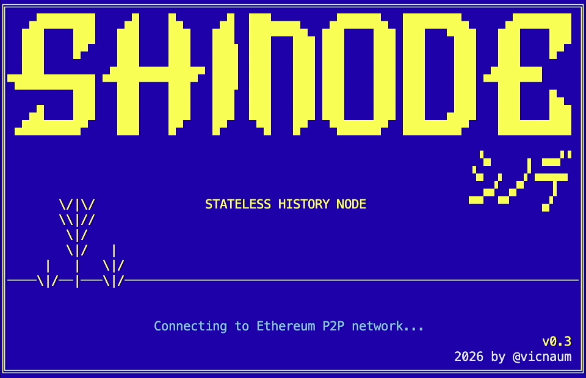
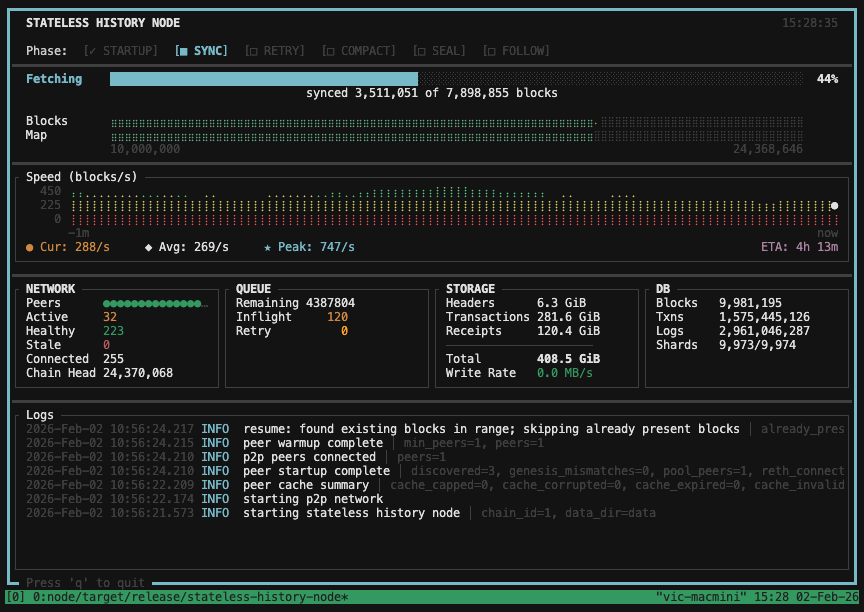

# SHiNode (Stateless History Node)

````
   ▄████████    ▄█    █▄     ▄█  ███▄▄▄▄    ▄██████▄  ████████▄     ▄████████ 
  ███    ███   ███    ███   ███  ███▀▀▀██▄ ███    ███ ███   ▀███   ███    ███ 
  ███    █▀    ███    ███   ███▌ ███   ███ ███    ███ ███    ███   ███    █▀  
  ███         ▄███▄▄▄▄███▄▄ ███▌ ███   ███ ███    ███ ███    ███  ▄███▄▄▄     
▀███████████ ▀▀███▀▀▀▀███▀  ███▌ ███   ███ ███    ███ ███    ███ ▀▀███▀▀▀     
         ███   ███    ███   ███  ███   ███ ███    ███ ███    ███   ███    █▄  
   ▄█    ███   ███    ███   ███  ███   ███ ███    ███ ███   ▄███   ███    ███ 
 ▄████████▀    ███    █▀    █▀    ▀█   █▀   ▀██████▀  ████████▀    ██████████ 

       \/|\/                                                    ▝▄     ▖ ▄▄▞▝
       \\|//               STATELESS HISTORY NODE              ▝▄  ▖  ▗▘▄▄▄▄▖
        \|/                                                      ▄▞ ▗▞▘   ▐  
        \|/   |                                                ▀▀  ▀▘    ▄▘  
     |   |   \|/         
────\|/──|───\|/─────────────────────────────────────────────────────────────
````

A lightweight Ethereum history node that syncs headers, transactions, receipts, and logs directly from the P2P network and serves them via JSON-RPC.
Think of it as an **alternative to running a full node** when all you need is event logs for indexing.

**Use case:** Run indexers like [rindexer](https://github.com/joshstevens19/rindexer) against your own local node instead of paying for RPC services.

[](LICENSE-MIT)
[](https://www.rust-lang.org/)
[](https://ethereum.org/)
[](ROADMAP.md)
[](https://cursor.com/)


### Why SHiNode?

Running a full Ethereum node just to index events is expensive — terabytes of state, constant maintenance through forks, and slow sync times. Paying for RPC providers costs even more. SHiNode gives you a **free, local, unlimited RPC** for event indexing without any of that.

- **Fast sync** — over 1,000 blocks/sec. Full Mainnet history in ~6 hours on modern hardware with SSD, under a day even on older machines or HDDs
- **Runs on anything** — low CPU, low memory, works on HDDs. A Mac Mini, a Hetzner VPS, or that old PC in the closet
- **Small footprint** — full Mainnet sync is under 800 GB with transactions, or ~250 GB for events only
- **Partial sync** — start from any block. Only need Uniswap V3? Start from its deployment block (default start is block 10M — Uniswap V2 deployment)
- **Indexer-compatible** — plug in [rindexer](https://github.com/joshstevens19/rindexer), Ponder, or any indexer that uses `eth_getLogs`
- **Zero maintenance** — no EVM upgrades, no fork management, no pruning. Just run it
- **Free local RPC** — no rate limits, no API keys, no monthly bills. Your data, on your machine

### Known Limitations

- **Ethereum Mainnet only** — L2s don't expose receipts over P2P yet. Hoping that changes
- **No verification yet** — data is fetched from P2P peers without proof validation. Planned: receipt hash verification, and optional CL node for full integrity
- **History may thin out** — with EIP-4444 and The Purge, historical P2P data isn't guaranteed forever. Planned: [era1](https://github.com/ethereum/go-ethereum/pull/26621) archive and [Portal Network](https://www.ethportal.net/) support
- **No SHiNode-to-SHiNode sync yet** — planned: sync sealed shards between nodes via P2P, torrents, or HTTP archives

### What It Can Do

- **Sync ETH Mainnet** — any block range from the Ethereum P2P network — no RPC provider needed, no beacon node required
- **Follow the chain head** — stay synced with new blocks and handle reorgs automatically
- **Serve event logs** — `eth_getLogs` with filtering by block range, address, and topics
- **Serve block data** — `eth_getBlockByNumber` with transaction hashes
- **Run indefinitely** — graceful shutdown, restart-safe checkpoints, resumes where it left off
- **Visualize progress** — fullscreen TUI dashboard with sync speed, coverage map, and real-time stats

### What It Cannot Do

**By design (stateless architecture):**
- **No `eth_call`** — requires EVM execution and state trie, which we intentionally don't maintain
- **No traces** — same reason, requires execution
- **No state queries** — balances, storage, contract reads all require state

**Not yet implemented:**
- **`eth_getBlockByHash`** — planned
- **Transaction receipts endpoints** — `eth_getTransactionReceipt`, `eth_getBlockReceipts` are planned
- **WebSocket subscriptions** — polling only for now
- **Calldata storage** — we store all transaction fields except `input` data (to save space); planned as optional
- **Prometheus/OpenTelemetry metrics** — planned

### Current Status (v0.3.0)

Core sync and RPC functionality is **stable and usable for testing indexing workloads**.

SHiNode should be able to sync tens of millions of blocks and serve `eth_getLogs` queries reliably.

See [ROADMAP.md](ROADMAP.md) for detailed version history and planned features.

## Philosophy



- **Stateless by design**: no EVM execution or state trie. No caring about EVM upgrades and forks.
- **Small, auditable surface**: minimal persistence and RPC for indexers.
- **Reuse Reth primitives**: networking, static-file storage, and safety defaults.

## Quick Start

Requires Rust and a C toolchain. On Ubuntu/Debian: `apt install build-essential`. See [prerequisites](docs/getting-started.md#prerequisites) for details.

```bash
# Build
cargo build --release

# Run (syncs from block 10M to head)
cargo run --release

# Custom range
cargo run --release -- --start-block 18000000 --end-block 18100000

# Disable TUI (use legacy progress bars)
cargo run --release -- --no-tui
```

Stop with Ctrl+C. The node persists checkpoints and resumes on restart.

For detailed setup, see [docs/getting-started.md](docs/getting-started.md).

## Documentation

- [Getting Started](docs/getting-started.md) - Installation and first run
- [Configuration](docs/configuration.md) - Full CLI options reference
- [Architecture](docs/architecture.md) - System overview and design
- [Roadmap](ROADMAP.md) - Current and planned features
- [UI Designs](docs/UI_DESIGNS.md) - TUI dashboard design reference

## CLI Options (Common)

```
--start-block <u64>     First block to sync (default: 10_000_000)
--end-block <u64>       Optional final block to stop at
--data-dir <path>       Data directory (default: data)
--rpc-bind <ip:port>    RPC bind address (default: 127.0.0.1:8545)
--shard-size <u64>      Blocks per shard (default: 10_000, for slow HDDs use 1_000)
--rollback-window <u64> Max reorg depth (default: 64)
--min-peers <u64>       Wait for N peers before sync (default: 1)
--no-tui                Disable fullscreen TUI dashboard
-v/-vv/-vvv             Verbosity levels
--defer-compaction       Skip inline compaction during sync (good for slow HDDs)
--repair                Repair storage (run as subcommand)
--log                   Enable all log artifacts
--log-resources         Include CPU/memory/disk metrics
```

Subcommands:

```
db stats                Print storage statistics
db compact              Compact all dirty shards and seal completed ones
  --log-json            Write JSON logs to file for debugging
  -v/-vv/-vvv           Verbosity (info/debug/trace)
db rebuild-cache        Rebuild sealed shard cache for faster startup
```

Example: debug slow compaction on USB HDD:

```bash
cargo run --release -- \
  db compact --log-json compact.jsonl -v
```

The JSON log includes per-shard timing breakdown (WAL index, segment I/O, fsync, swap, cleanup).

See [docs/configuration.md](docs/configuration.md) for all options.

## TUI Dashboard



The node features a fullscreen terminal dashboard (powered by ratatui) that shows:

- **Phase indicator**: Startup > Sync > Retry > Compact > Seal > Follow
- **Progress bar** with percentage and block counts
- **Blocks coverage map** using braille characters with color gradient
- **Speed chart** with 1-minute history, current/average/peak speeds, and ETA
- **Network panel**: peer visualization (active/idle/stale dots), chain head
- **Queue panel**: remaining/inflight/retry block counts
- **Storage panel**: per-segment size breakdown, total size, write rate
- **DB panel**: block/transaction/log counts, shard compaction status
- **RPC panel** (follow mode): request rates, method counters, errors
- **Log viewer**: real-time log entries with level coloring

Press `q` to quit. Use `--no-tui` for headless environments.

## Debugging

Send `SIGUSR1` to print sync + peer-health debug dump:

```bash
kill -USR1 <pid>
```

## RPC Support

Implemented:
- `eth_chainId`
- `eth_blockNumber`
- `eth_getBlockByNumber` (with `includeTransactions=false`)
- `eth_getLogs` (filtered by block range, address, topic0)

Notes:
- `totalDifficulty` is mocked to `0x0`.
- `withdrawals` are always `null` (not stored).
- All other methods return `-32601`.

## Project Layout

```
node/           Stateless history node implementation
  src/
    bin/        Main binary
    cli/        CLI and config
    run/        Orchestration (startup, sync, cleanup)
    p2p/        devp2p networking
    sync/       Sync pipeline and scheduling
    storage/    Sharded static-file storage
    rpc/        JSON-RPC server
    ui/         TUI dashboard and progress bars
    logging/    JSON logs, reports, metrics
docs/           User-facing documentation
  spec/         Research docs and development history
```

